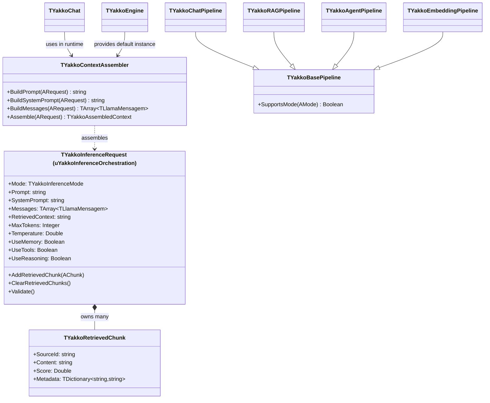
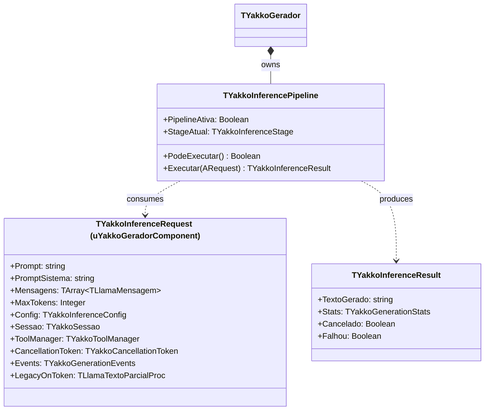
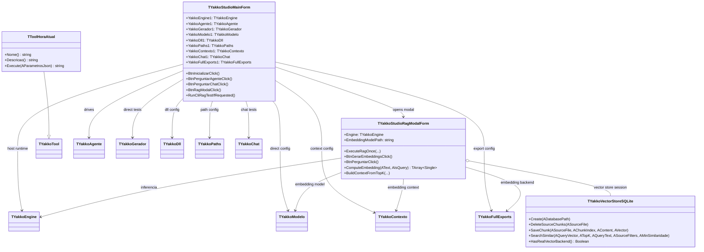
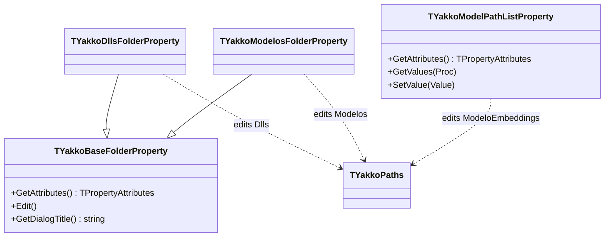

# Diagrama de Classes - YakkoDelphiLLM

Legenda de relacoes UML (Mermaid):
- `A --|> B` heranca
- `A *-- B` composicao (ownership)
- `A o-- B` agregacao (referencia)
- `A --> B` associacao
- `A ..> B` dependencia

## 1) Core Runtime (classes, membros e relacionamentos)

```mermaid
classDiagram
        class TYakkoPaths {
            +Dlls: string
            +Modelos: string
            +ModeloEmbeddings: string
        }

        class TYakkoSamplingParams {
            +Temperature: Single
            +TopK: Integer
            +TopP: Single
            +Seed: Cardinal
            +ResetToDefaults()
            +AssignFrom()
        }

        class TYakkoInferenceConfig {
            +MaxTokens: Integer
            +NCtx: Integer
            +Threads: Integer
            +AutoResumo: Boolean
            +AutoResumoLimiar: Double
            +AutoResumoMaxTokens: Integer
            +AutoResumoMensagensRecentes: Integer
            +UseThinkMode: Boolean
            +ShowThinkBlocks: Boolean
            +SanitizeOutput: Boolean
            +Sampling: TYakkoSamplingParams
            +Clone() TYakkoInferenceConfig
            +ResetToDefaults()
        }

        class TYakkoFullExports {
            +DllPath: string
            +Carregado: Boolean
            +Carregar(ACaminho)
            +Descarregar()
            +EstaCarregado() Boolean
        }

        class TYakkoDll {
            +Caminho: string
            +Carregar(ACaminho)
            +Descarregar()
            +EstaCarregado() Boolean
        }

        class TYakkoModelo {
            +DllPath: string
            +ModelPath: string
            +GpuLayersPadrao: Integer
            +FullExports: TYakkoFullExports
            +Handle: TLlamaModelHandle
            +Vocab: TLlamaVocabHandle
            +Carregar(ACaminho, AGpuLayers)
            +Descarregar()
            +EstaCarregado() Boolean
            +PodeDestruir() Boolean
            +NCtxTrain() Integer
            +NEmbedding() Integer
            +Descricao() string
        }

        class TYakkoChatTemplate {
            +Modelo: TYakkoModelo
            +BuildPrompt(...)
            +BuildPromptFromLegacy(...)
            +PodeMontarPrompt() Boolean
            +SupportsTools() Boolean
            +SupportsReasoning() Boolean
        }

        class TYakkoTokenizer {
            +Modelo: TYakkoModelo
            +CountTokens(ATexto) Integer
            +Tokenize(ATexto) TLlamaTokenArray
            +Detokenize(ATokens) string
            +TruncateToFit(ATexto, AMaxTokens) string
            +PodeTokenizar() Boolean
        }

        class TYakkoContexto {
            +Modelo: TYakkoModelo
            +Config: TYakkoInferenceConfig
            +NCtxPadrao: Cardinal
            +Handle: TLlamaContextoHandle
            +Abrir(ACtxSize, AThreads)
            +Fechar()
            +EstaAberto: Boolean
            +NCtx() Cardinal
            +NThreads() Int32
            +PodeDestruir() Boolean
        }

        class TYakkoSessao {
            +Contexto: TYakkoContexto
            +Config: TYakkoInferenceConfig
            +Chat: TComponent
            +SessaoAtiva: Boolean
            +KVCacheValido: Boolean
            +EmGeracao: Boolean
            +ResetarSessao()
            +LimparKVCache()
            +MarcarGeracaoIniciada()
            +MarcarGeracaoFinalizada(AGerouTokens)
            +PodeGerar() Boolean
            +PodeDestruir() Boolean
        }

        class TYakkoGenerationEvents {
            +OnToken
            +OnFinished
            +OnError
            +OnCancelled
            +OnStatistics
            +OnReasoningToken
            +OnToolCall
            +Clear()
        }

        class TYakkoCancellationToken {
            +Cancel()
            +Reset()
            +IsCancelled() Boolean
        }

        class TYakkoTool {
            +Enabled: Boolean
            +Nome() string
            +Descricao() string
            +Execute(AParametrosJson) string
        }

        class TYakkoJsonToolParser {
            +TryParse(ARawPayload, out AToolCall) Boolean
        }

        class TYakkoToolManager {
            +Parser: IYakkoToolCallParser
            +RegistrarTool(ATool)
            +EncontrarTool(ANome) TYakkoTool
            +ExecutarToolCall(AToolCall) TYakkoToolResult
            +TryParseToolCall(ARawPayload, out AToolCall) Boolean
            +TryProcessRawPayload(...)
        }

        class TYakkoMemoryManager {
            +Tokenizer: TYakkoTokenizer
            +ChatTemplate: TYakkoChatTemplate
            +Gerador: TYakkoGerador
            +Config: TYakkoInferenceConfig
            +EstimarUsoContexto(...) Integer
            +DeveResumir(...) Boolean
            +ResumirHistorico(...) Boolean
            +AjustarContexto(...)
            +PodeResumir() Boolean
        }

        class TYakkoInferencePipeline {
            +PipelineAtiva: Boolean
            +StageAtual: TYakkoInferenceStage
            +PodeExecutar() Boolean
            +Executar(ARequest) TYakkoInferenceResult
        }

        class TYakkoGerador {
            +Modelo: TYakkoModelo
            +Contexto: TYakkoContexto
            +Sessao: TYakkoSessao
            +ChatTemplate: TYakkoChatTemplate
            +Tokenizer: TYakkoTokenizer
            +ToolManager: TYakkoToolManager
            +Config: TYakkoInferenceConfig
            +Events: TYakkoGenerationEvents
            +CancellationToken: TYakkoCancellationToken
            +InferencePipeline: TYakkoInferencePipeline
            +GenerationState: TYakkoGenerationState
            +Gerar(APrompt, AMaxTokens, AAoReceberTexto) string
            +GerarComMensagens(...) string
            +EstimarTokensComMensagens(...) Integer
            +ContextoDisponivel() Integer
            +ResetarContexto()
            +CancelarGeracao()
            +PodeGerar() Boolean
            +PodeExecutarPipeline() Boolean
        }

        class TYakkoChat {
            +Gerador: TYakkoGerador
            +MemoryManager: TYakkoMemoryManager
            +ContextAssembler: TYakkoContextAssembler
            +Config: TYakkoInferenceConfig
            +PromptSistema: string
            +Perguntar(APrompt, AMaxTokens, AAoReceberTexto) string
            +RegistrarTroca(APrompt, AResposta)
            +AtualizarUltimaMensagemAssistente(AConteudo)
            +ReiniciarSessao()
            +LimparHistorico()
            +EstimarTokensSessao() Integer
            +QuantidadeMensagens() Integer
            +AutoResumoContagem() Integer
            +PodeGerar() Boolean
        }

        class TYakkoEngine {
            +Paths: TYakkoPaths
            +Config: TYakkoInferenceConfig
            +FullExports: TYakkoFullExports
            +Modelo: TYakkoModelo
            +ChatTemplate: TYakkoChatTemplate
            +Tokenizer: TYakkoTokenizer
            +Contexto: TYakkoContexto
            +Sessao: TYakkoSessao
            +ToolManager: TYakkoToolManager
            +MemoryManager: TYakkoMemoryManager
            +Gerador: TYakkoGerador
            +Chat: TYakkoChat
            +ContextAssembler: TYakkoContextAssembler
            +NovaChat() TYakkoChat
            +SincronizarPathsModelo()
            +PodeDestruir() Boolean
        }

        class TYakkoAgente {
            +Active: Boolean
            +AutoInitialize: Boolean
            +Engine: TYakkoEngine
            +OutputMemo: TMemo
            +SystemPrompt: string
            +NCtxPadrao: Cardinal
            +MaxTokensPadrao: Integer
            +GpuLayers: Integer
            +Temperatura: Single
            +TopK: Integer
            +TopP: Single
            +InitializeAgent()
            +FinalizeAgent()
            +RestartSession()
            +Ask(APrompt, AMaxTokens) string
            +IsInitialized() Boolean
        }

        TYakkoInferenceConfig *-- TYakkoSamplingParams : owns

        TYakkoEngine o-- TYakkoPaths : uses
        TYakkoEngine *-- TYakkoInferenceConfig : owns
        TYakkoEngine *-- TYakkoFullExports : owns
        TYakkoEngine o-- TYakkoModelo : aggregates
        TYakkoEngine o-- TYakkoChatTemplate : aggregates
        TYakkoEngine o-- TYakkoTokenizer : aggregates
        TYakkoEngine o-- TYakkoContexto : aggregates
        TYakkoEngine o-- TYakkoSessao : aggregates
        TYakkoEngine o-- TYakkoToolManager : aggregates
        TYakkoEngine o-- TYakkoMemoryManager : aggregates
        TYakkoEngine o-- TYakkoGerador : aggregates
        TYakkoEngine o-- TYakkoChat : aggregates
        TYakkoEngine o-- TYakkoContextAssembler : aggregates

        TYakkoModelo --> TYakkoFullExports : backend exports
        TYakkoDll ..> TYakkoFullExports : helper loader

        TYakkoChatTemplate --> TYakkoModelo : depends
        TYakkoTokenizer --> TYakkoModelo : depends
        TYakkoContexto --> TYakkoModelo : depends
        TYakkoContexto --> TYakkoInferenceConfig : depends

        TYakkoSessao --> TYakkoContexto : depends
        TYakkoSessao --> TYakkoInferenceConfig : depends

        TYakkoToolManager *-- TYakkoTool : owns registered tools
        TYakkoToolManager --> TYakkoJsonToolParser : default parser

        TYakkoGerador *-- TYakkoGenerationEvents : owns
        TYakkoGerador *-- TYakkoCancellationToken : owns
        TYakkoGerador *-- TYakkoInferencePipeline : owns
        TYakkoGerador --> TYakkoModelo : depends
        TYakkoGerador --> TYakkoContexto : depends
        TYakkoGerador --> TYakkoSessao : depends
        TYakkoGerador --> TYakkoChatTemplate : depends
        TYakkoGerador --> TYakkoTokenizer : depends
        TYakkoGerador --> TYakkoToolManager : depends
        TYakkoGerador --> TYakkoInferenceConfig : depends

        TYakkoMemoryManager --> TYakkoTokenizer : depends
        TYakkoMemoryManager --> TYakkoChatTemplate : depends
        TYakkoMemoryManager --> TYakkoGerador : depends
        TYakkoMemoryManager --> TYakkoInferenceConfig : depends

        TYakkoChat --> TYakkoGerador : depends
        TYakkoChat --> TYakkoMemoryManager : depends
        TYakkoChat --> TYakkoContextAssembler : depends
        TYakkoChat --> TYakkoInferenceConfig : depends

        TYakkoAgente --> TYakkoEngine : facade high-level
```

## 2) Orquestracao de inferencia (backend-agnostic)

## 3) Pipeline interno do gerador (runtime)

## 4) Aplicacao VCL e RAG

## 5) Design-time (registro no Delphi IDE)

